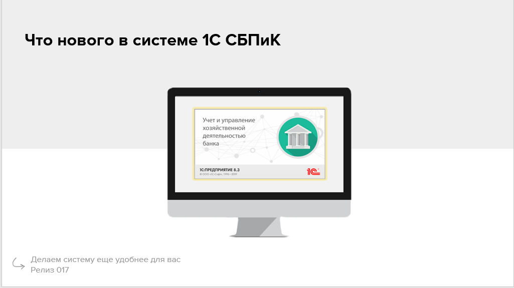

<!--
_footer: aplastinin.ru, 2022
-->

## Презентация - это тоже **код**

#### Обзор фреймворка **Marp**

---

<h5>DevOps</h>

<h5>Импортозамещение</h5>

---

# DevOps

## _All is code_

1. Исходники -> cf, cfu
2. Markdown -> Docs
3. PlantUML -> Diagrams, sheme

---

## Презентации. **Зачем?**

---

## Импорто**замещение**

---

# **Пре**мущества

* Минимализм и плоский дизайн
* Онлайн-доступ / Оффлайн-функционирование
* Кроссплатформенность
* Git (GitFlow)
* Интеграции в несколько форматов
* CLI
* IDE
* Mardown
* Автоматическая сборка
* Free 💰

---

# **Недо**статки

* Техническая сложность
* Отсутствие визуальный редактора